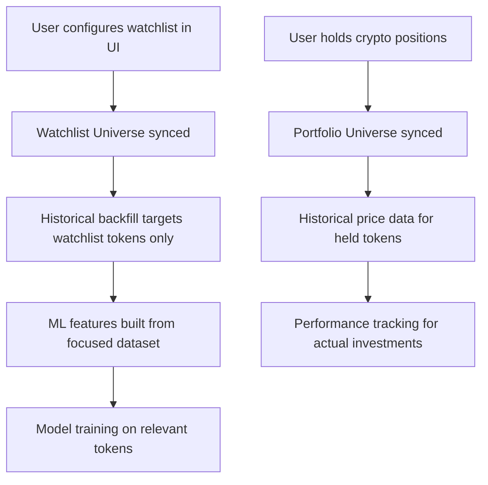

# Universe Integration with UI and Portfolio

This document explains how the three-tier universe system integrates with your existing UI watchlist and portfolio management.

## Architecture Overview

### Current Integration Points

1. **Watchlist Universe** ↔ **UI Watchlist Management**
   - **Source**: `/admin/watchlist` endpoints and `/pages/watchlist.tsx`
   - **Collection**: `tokens` (where `active=true`)
   - **Sync**: Automatic on watchlist changes + periodic sync

2. **Portfolio Universe** ↔ **Active Crypto Positions** 
   - **Source**: Portfolio data from `/pages/portfolio.tsx`
   - **Collection**: `portfolio` (positions with `quantity > 0`)
   - **Sync**: Automatic on position changes + high-frequency sync

3. **Market Universe** ↔ **Top Market Cap Tokens**
   - **Source**: CoinGecko top tokens by market cap
   - **Collection**: Auto-populated top 100-500 tokens
   - **Sync**: Daily refresh

## How It Works

### Watchlist Universe Integration

```
UI Watchlist Action → Backend Endpoint → Universe Auto-Sync
```

**When you add/remove tokens in the UI watchlist:**
1. User adds token via `/pages/watchlist.tsx`
2. Frontend calls `POST /admin/watchlist` 
3. Backend saves to `tokens` collection with `active=true`
4. **Auto-trigger**: `universe_manager.sync_watchlist_universe_from_ui()`
5. Watchlist Universe is automatically updated

**Universe sync logic:**
- Pulls all tokens from `tokens` collection where `active=true`
- Maps to `watchlistUniverse` collection with ML-ready format
- Used by `/fetch/features` for targeted data collection

### Portfolio Universe Integration

```
Portfolio Positions → Universe Sync → Real-time Data Fetching
```

**When you have active crypto positions:**
1. Portfolio positions stored in `portfolio` collection
2. Periodic sync: `universe_manager.sync_portfolio_universe_from_positions()`
3. Finds all positions where `quantity > 0`
4. Maps to `portfolioUniverse` collection
5. Used by `/fetch/portfolio` for high-frequency price updates

### Data Flow Example

```mermaid
graph TD
    A[User adds BTC to watchlist] --> B[POST /admin/watchlist]
    B --> C[Save to tokens collection active=true]
    C --> D[Auto-sync watchlist universe]
    D --> E[BTC added to watchlistUniverse]
    E --> F[/fetch/features includes BTC data]
    F --> G[ML features generated for BTC]
    
    H[User buys 0.5 ETH] --> I[Portfolio position quantity=0.5]
    I --> J[Sync portfolio universe]
    J --> K[ETH added to portfolioUniverse]
    K --> L[/fetch/portfolio gets real-time ETH price]
```

## Automatic Synchronization

### Real-time Sync Triggers
- **Watchlist changes**: Immediate sync on add/remove token
- **Portfolio changes**: Sync every 15 minutes to catch new positions

### Scheduled Sync Jobs
```bash
# Sync all universes every 4 hours (full refresh)
0 */4 * * * curl -X POST "/admin/universes/sync"

# Sync watchlist universe hourly (catch any missed UI changes)  
0 * * * * curl -X POST "/admin/universes/watchlist/sync"

# Sync portfolio universe every 15 minutes (active positions)
*/15 * * * * curl -X POST "/admin/universes/portfolio/sync"
```

### Manual Sync Endpoints
```bash
# Sync all universes with current data
POST /admin/universes/sync

# Sync specific universe
POST /admin/universes/watchlist/sync
POST /admin/universes/portfolio/sync  
POST /admin/universes/market/sync
```

## Data Collection Optimization

### Before Universe System
```bash
# Fetched data for ALL tokens regardless of relevance
POST /fetch/coingecko  # 500+ tokens, hourly
POST /fetch/moralis    # 500+ tokens, hourly  
POST /fetch/lunarcrush # 500+ tokens, 4x daily
```

### After Universe System
```bash
# Market Universe: Top 100-500 tokens, macro trends
POST /fetch/market-summary  # 100-500 tokens, hourly
POST /fetch/market-tokens   # 100-500 tokens, 30min

# Watchlist Universe: Your curated list, ML features  
POST /fetch/features        # 10-50 tokens, 30min, ALL APIs

# Portfolio Universe: Your positions, real-time data
POST /fetch/portfolio       # 2-10 tokens, 5min, price focus
```

**Cost Savings**: ~70-90% reduction in API calls by targeting relevant tokens

## Monitoring and Observability

### Universe Status
```bash
# View all universe statistics
GET /admin/universes

# Check specific universe details  
GET /admin/universes/watchlist
GET /admin/universes/portfolio
GET /admin/universes/market
```

### Run Logging
All data fetches now include universe context:
```json
{
  "service": "features",
  "universe": "watchlist", 
  "count": 15,
  "status": "success",
  "timestamp": "2025-10-09T10:00:00Z"
}
```

## Best Practices

### For Watchlist Management
1. **Use the UI**: Add/remove tokens via `/pages/watchlist.tsx`
2. **Curate wisely**: Keep watchlist focused (≤100 tokens) for ML efficiency
3. **Monitor sync**: Check universe sync logs for any issues

### For Portfolio Management
1. **Active positions**: Universe automatically tracks positions with `quantity > 0`
2. **Real-time data**: Portfolio tokens get highest frequency updates (5min)
3. **Position changes**: Sync happens every 15min to catch new trades

### For Market Analysis
1. **Automatic**: Market universe auto-populates with top tokens
2. **Macro focus**: Used for overall market trend analysis
3. **Lower frequency**: Hourly updates sufficient for macro metrics

## Troubleshooting

### Universe Out of Sync
```bash
# Force full resync
curl -X POST "/admin/universes/sync"

# Check universe contents
curl -X GET "/admin/universes/watchlist"
```

### Missing Tokens in Data Fetch
1. Check if token is in correct universe: `GET /admin/universes/{universe_name}`
2. Verify token is active in source: `GET /admin/watchlist` or portfolio
3. Force sync: `POST /admin/universes/{universe_name}/sync`

### Performance Issues  
1. **Watchlist too large**: Keep ≤100 tokens for optimal ML performance
2. **Portfolio sync frequency**: Adjust from 15min if needed
3. **Market universe size**: Default 100-500 tokens, adjustable

## Historical Data Integration

### Universe-Targeted Historical Backfill

The historical populate functions now use your universe system for focused data collection:

```bash
# Default: Watchlist Universe (recommended for ML)
POST /admin/populate/historical-data?universe=watchlist&days_back=90

# Portfolio Universe (your actual positions)
POST /admin/populate/historical-data?universe=portfolio&days_back=30

# Market Universe (macro analysis)
POST /admin/populate/historical-data?universe=market&days_back=365

# Convenience endpoints with optimized defaults
POST /admin/populate/historical-watchlist  # 90 days, ML-focused sources
POST /admin/populate/historical-portfolio  # 30 days, price-focused
POST /admin/populate/historical-market     # 365 days, market-focused
```

### Cost Optimization Through Targeting

**Before Universe Integration:**
```bash
# Historical backfill for ALL tokens (500+ tokens × 365 days)
POST /admin/populate/historical-data?days_back=365
# Result: 182,500+ API calls
```

**After Universe Integration:**
```bash  
# Historical backfill for WATCHLIST tokens only (15 tokens × 365 days)
POST /admin/populate/historical-data?universe=watchlist&days_back=365
# Result: 5,475 API calls (97% reduction!)
```

### Automated Historical Maintenance

```bash
# Weekly: Keep watchlist data fresh for ML training
0 3 * * 0 curl -X POST "/admin/populate/historical-watchlist?days_back=7"

# Monthly: Maintain portfolio performance history  
0 4 1 * * curl -X POST "/admin/populate/historical-portfolio?days_back=30"

# Quarterly: Update market trend analysis
0 5 1 1,4,7,10 * curl -X POST "/admin/populate/historical-market?days_back=90"
```

### Historical Data Flow



This integration ensures your universe system always reflects your actual trading interests and positions, optimizing both cost and relevance of the data collection system for both real-time and historical data operations.